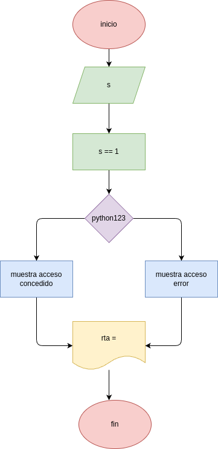

### el validador de "passwords

## analisis

### variable de entrada
p = contraseña

### procedimiento
while True:
    p=input("Error, vuelva a intentarlo: ")
    if p == "python123":
        break
print("---------------------")
print("acceso concedido")
print("---------------------")

## diceño
