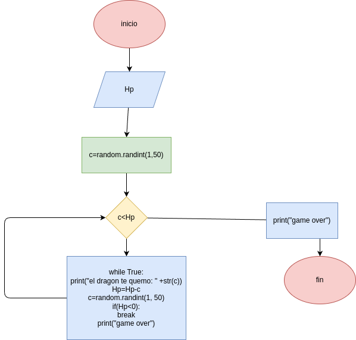

### tu personaje tiene 50 puntosde vida (HP)

## analisis

### variable de entrada
V = el dragon tiene 50 puntos de vida (HP)

### procedimiento
c=random.randint(1,50)
Hp=int(input("digite el valor de tu vida que es 50: "))
while True:
    print("el dragon te quemo:" +str(c))
    Hp=Hp-c
    c=random.randint(1,50)
    if Hp <= 0:
        break
print("game over")

## diseño

