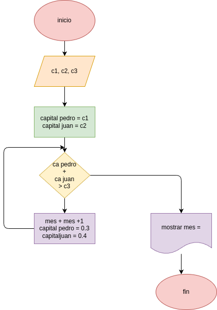

# pedro tiene un capital de c1pesos, y juan de c2 pesos

## analisis

### variable de entrada
c1, c2, c3

### procedimiento
n=0
while True:
    c1=c1+(c1*0.03)
    c2=c2+(c2*0.04)
    n=n+1
    if (c1+c2)>1000000:
        break

## diseño

